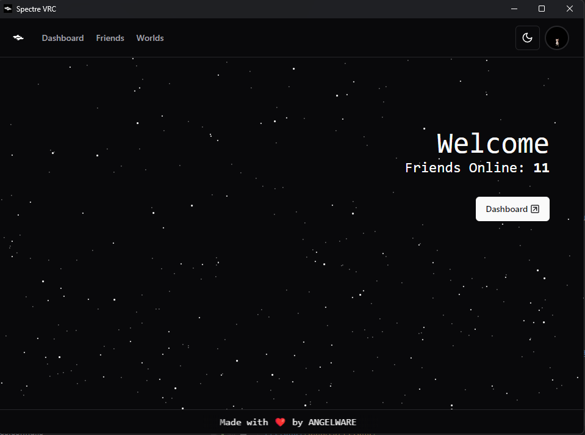
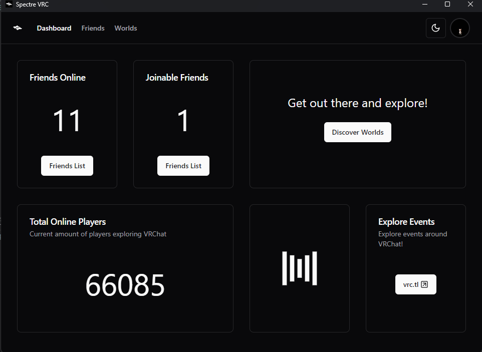
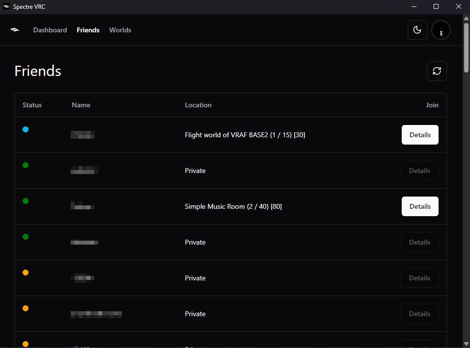
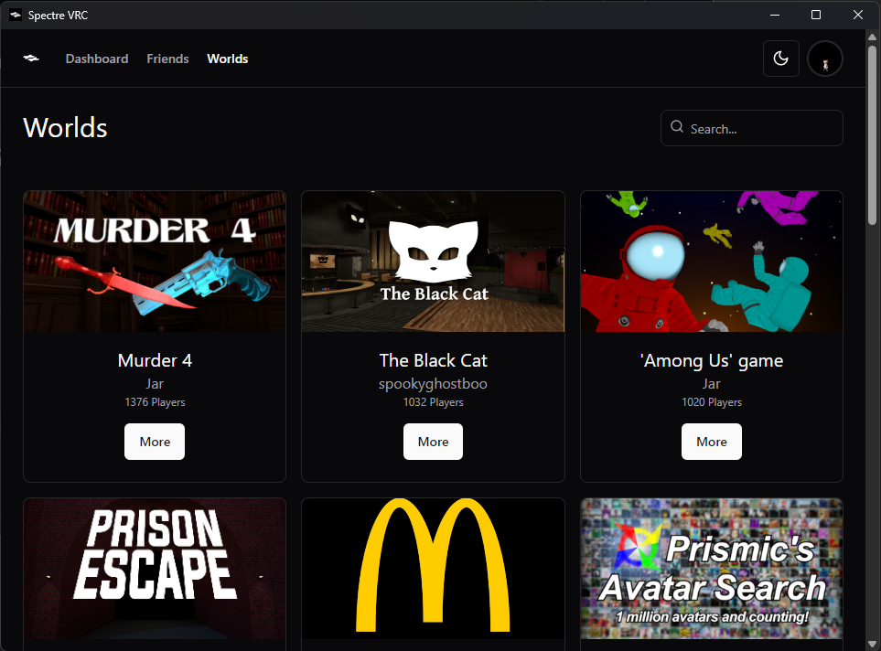

# Spectre
A lightweight friends list manager for VRChat. Built on Sveltekit + Tauri. Thanks to Tauri, Spectre is cross-platform by default*, with potential support for mobile in the future.

*Cross-platform builds will only be published for full release builds.

## Warning
This project is largely under development, things may be broken or imperfect! I built this project to learn Typescript and Tauri, so go easy on me >.< VRC's official stance on using their API is to use it non-maliciously, spectre performs no malicious functions, but makes a large number of API calls. I am not responsible for your account getting rate-limited or locked.

## Philosophy
The goal of Spectre is to provide a minimal, fast, and easy way to view your VRC friends list without opening the website. It is meant to only give you the information you want to see, without logging tons of information you do not need to see, such as avatar changes, or constant location updates. Spectre only includes the features you need and not the ones you don't.

## Building

For development:
```shell 
cargo tauri dev
```

For production:
```shell
cargo tauri build
```

## Current Features
- Dashboard: Get a quick overview of your friends online and the current VRChat player count.
- Friends List: See who's online and their status.

## WIP
- User / World Cards: Show data on users and worlds.
- Friends List Filters: Adjust how your friends list is organized.
- Feed: A websocket feed with customizable filters for events.
- Settings: A more customizable experience.

## Credits
- [Community-driven VRCAPI Docs](https://vrchatapi.github.io/docs/api/)
- [shadcn-svelte](https://www.shadcn-svelte.com/)
- @Auros for help learning

## Screenshots



