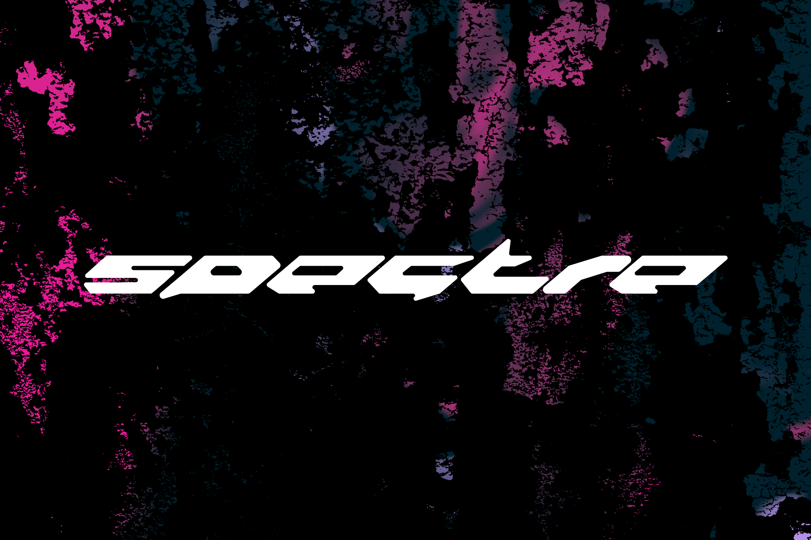

# Spectre
A lightweight friends list manager for VRChat. Built on Sveltekit + Tauri. Thanks to Tauri, Spectre is cross-platform by default, with potential support for mobile in the future.

## Warning
This project is largely under development, security may not be perfect. 

## Building

For development:
```shell 
cargo tauri dev
```

For production:
```shell
cargo tauri build
```